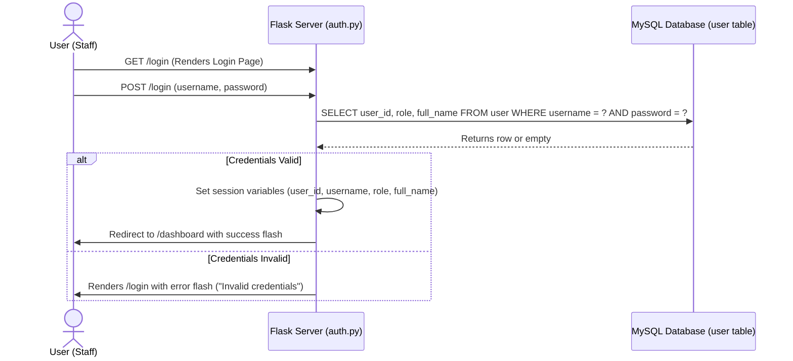
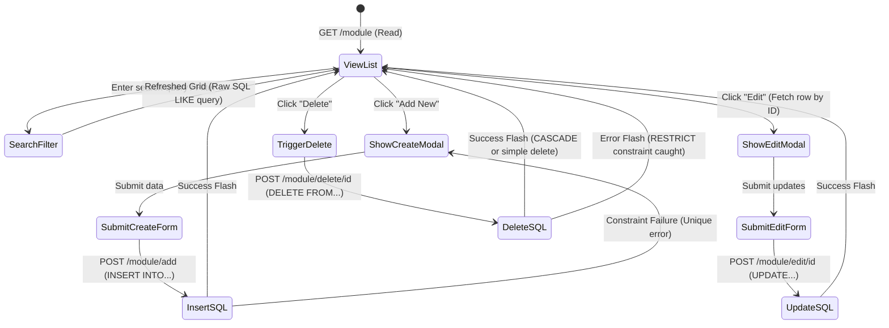
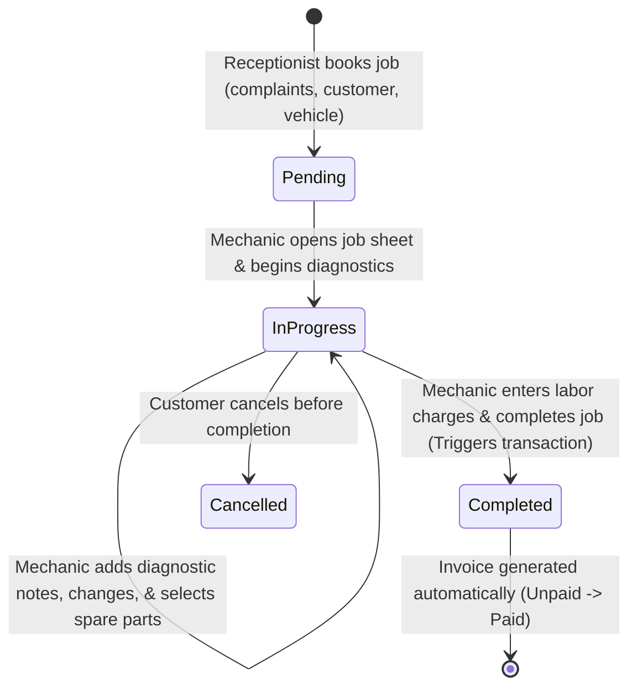
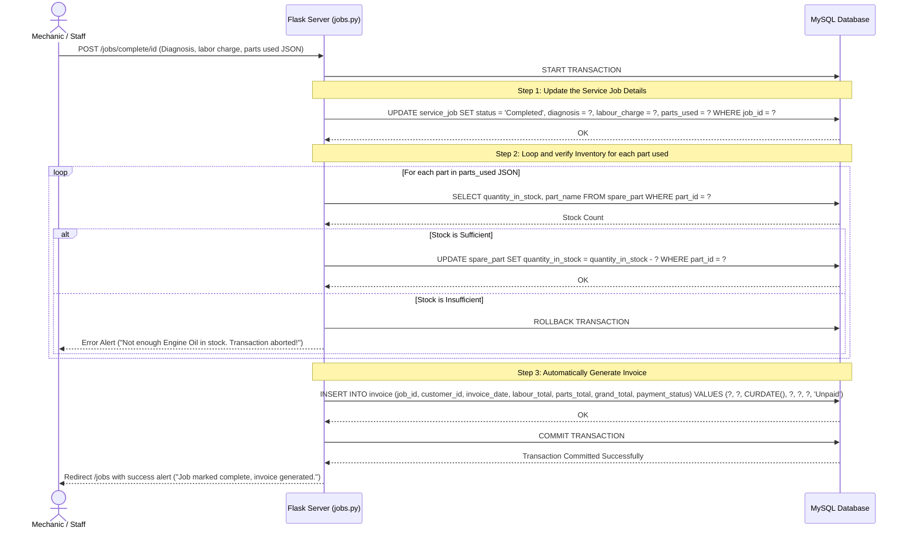

# Application Flow Document
## Project Name: Fender - Automobile Garage Management System

---

## 1. Authentication Flow
Fender uses session-based authentication to manage roles and access. The flow operates as follows:



---

## 2. Global Navigation Flow
The layout features a sidebar that displays navigation options dynamically depending on the user's role:

```text
[Login Page]
     │
     └── Success ──> [Dashboard (Home)]
                          │
         ┌────────────────┴───────────────┐
         ▼                                ▼
  [Role-Based Sidebar]             [Top Navbar]
   ├── Owner:                      ├── Page Title
   │    ├── Dashboard               └── Logout Button
   │    ├── Customers & Vehicles
   │    ├── Suppliers & Inventory
   │    ├── Service Jobs
   │    ├── Invoices & Billing
   │    ├── DBMS Showcase (Viva Special)
   │    └── Analytics & Reports
   │
   ├── Manager:
   │    ├── Dashboard, Customers, Inventory, Service Jobs
   │
   ├── Receptionist:
   │    ├── Dashboard, Customers, Service Jobs, Invoices
   │
   └── Mechanic:
        └── My Assigned Jobs
```

---

## 3. CRUD Interaction Flow
Every standard database module (Customers, Suppliers, Spare Parts) follows a clean CRUD pattern using Bootstrap Modals to minimize page refreshes:



---

## 4. Service Job Lifecycle Flow
Service Jobs coordinate the core workflows on the shop floor. The status transitions guide this lifecycle:



---

## 5. ACID Transaction Flow (Service Job Completion)
When a mechanic changes a service job status to `Completed`, the backend must perform a series of operations. Because this updates inventory quantities and creates financial records, it is wrapped inside a single **ACID Transaction**:



### ACID Concept Explanations for Viva:
- **Atomicity**: Either the job updates, the inventory parts are deducted, and the invoice is created together, or nothing happens. There can never be a completed job without an invoice or stock reduction.
- **Consistency**: The database transitions from one valid state to another. A part's stock level can never go negative because of the checks before subtraction.
- **Isolation**: Concurrent transactions do not overwrite each other's updates (MySQL handles this via Row-level locking on the `spare_part` table during selection).
- **Durability**: Once `COMMIT` returns, the records are written to disk and will survive system failures.

---

## 6. Invoice Settlement Flow
Once an invoice is created, it follows a simple collection workflow:
1. Receptionist views the **Unpaid Invoices** tab.
2. Clicks the **Collect Payment** action button.
3. A modal prompts for **Payment Method** (Cash, Card, UPI, Bank Transfer) and **Payment Status** (Paid or Partially Paid).
4. Submitting the form runs the query:
   ```sql
   UPDATE invoice 
   SET payment_status = %s, payment_method = %s 
   WHERE invoice_id = %s;
   ```
5. If marked as fully `Paid`, the invoice changes color indicators from red to green.
