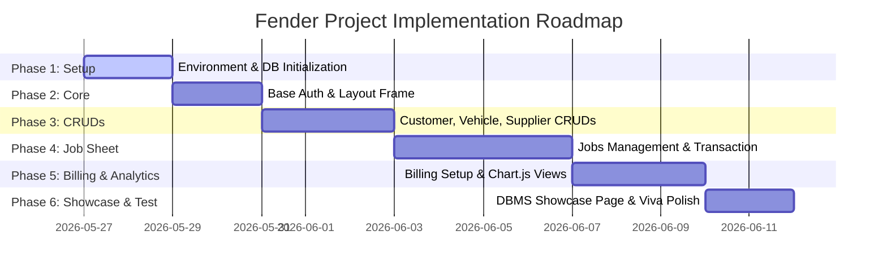

# Implementation Plan
## Project Name: Fender - Automobile Garage Management System

---

## 1. Phase-Wise Development Roadmap
The project is divided into six logical phases to ensure structured development, easy tracking, and progressive milestones.



---

## 2. Milestone Details

### Phase 1: Environment & DB Initialization
- **Goal**: Configure the developer workspace and verify database connectivity.
- **Tasks**:
  1. Create virtual python environment and write `requirements.txt`:
     ```text
     flask==3.0.0
     mysql-connector-python==8.2.0
     python-dotenv==1.0.0
     ```
  2. Setup local MySQL schema by importing `/database/schema.sql` and `/database/sample_inserts.sql` in MySQL Workbench.
  3. Create `app/db.py` to establish the connection pool and write basic fetch test scripts.
- **Estimated Complexity**: Low

### Phase 2: Base Auth & Layout Frame
- **Goal**: Build the UI shell and enforce session guards.
- **Tasks**:
  1. Write custom CSS overrides in `static/css/style.css` matching the Dark Mode theme colors.
  2. Implement the master template `templates/base.html` containing the responsive sidebar navigation, navbar breadcrumbs, and flash message toast containers.
  3. Setup `app/auth.py` session handling, login page UI (`templates/login.html`), and role restriction decorators (`@login_required`).
- **Estimated Complexity**: Low

### Phase 3: Customer, Vehicle & Supplier Directory
- **Goal**: Implement standard relational database table views and insertions.
- **Tasks**:
  1. Implement `app/routes/customers.py` containing search logic (`LIKE %s`) and forms for adding/editing customers.
  2. Add vehicle profiles creation tied to customer IDs (establishing 1-to-N relationships).
  3. Set up the Suppliers and Inventory catalogs, with indicators highlighting low stock where `quantity_in_stock <= reorder_level`.
- **Estimated Complexity**: Medium

### Phase 4: Service Job Sheets & ACID Transaction Handling
- **Goal**: Implement the core service job sheet and wrap the completion routine inside a database transaction.
- **Tasks**:
  1. Build the job intake form linking active vehicles and assigning mechanics.
  2. Create the mechanic service sheet form where diagnostics notes are input, labor costs are defined, and spare parts are appended.
  3. Implement the **ACID Transaction Routine** (detailed in `BACKEND_SCHEMA_PLAN.md`) which deducts quantities from `spare_part` inventory, raises alerts if stock is insufficient, updates the job sheet, and inserts an unpaid `invoice` in a single query transaction.
- **Estimated Complexity**: High (Due to SQL row locks, transactions, and rollback routines).

### Phase 5: Billing Settlement & Interactive Charts
- **Goal**: Create financial tracking panels and visual charts.
- **Tasks**:
  1. Create `app/routes/billing.py` to show active invoices, print receipts, and handle payments settlement.
  2. Build API routes returning data in JSON format for monthly earnings and job distributions.
  3. Integrate Chart.js in the dashboard home page to draw visual summaries.
- **Estimated Complexity**: Medium

### Phase 6: Educational DBMS Showcase & Verification
- **Goal**: Polish the app to serve as an impressive viva/practical exam presentation tool.
- **Tasks**:
  1. Create a **DBMS Showcase** page displaying:
     - **ER Diagram**: Visualized using SVG or Mermaid.js charts.
     - **Normalization Report**: Reviews deliberate 1NF (JSON storage in `parts_used`) and 3NF (derived fields in `invoice`) case studies.
     - **Constraint Lab**: Simulates clicking "Delete Customer" to show how the database catches and stops cascading issues via `ON DELETE RESTRICT`.
     - **Interactive Transaction Sandbox**: Tests committing and rolling back changes when inventory levels are exceeded.
- **Estimated Complexity**: Medium

---

## 3. Testing & Verification Checklist
Verify each of the following database behaviors before presenting the project:

### Relational integrity Tests
- [ ] **Cascade Rule Verification**: Delete a customer who has registered vehicles but *no* active service jobs. Verify in MySQL Workbench that the linked records in the `vehicle` table are automatically removed (`ON DELETE CASCADE`).
- [ ] **Restrict Rule Verification**: Attempt to delete a supplier whose spare parts exist in the inventory. Verify that the system intercepts the error code `1451` and outputs a user-friendly alert rather than crashing.
- [ ] **Unique Constraint Verification**: Attempt to add a vehicle with a duplicate registration plate number already in the database. Verify that the duplicate constraint rejects the insert.

### ACID Transaction Tests
- [ ] **Success Path**: Complete a service job using parts that are in stock. Verify that:
  - The job status updates to `Completed`.
  - The matching parts are deducted from the inventory.
  - A matching invoice is created.
- [ ] **Abort Path (Rollback)**: Attempt to complete a job that requests *more* spare parts than currently in stock. Verify that:
  - The transaction is rolled back.
  - The job status remains `In Progress`.
  - No inventory quantities are deducted.
  - No invoice is created.
  - The UI flashes a red warning explaining the failure.
