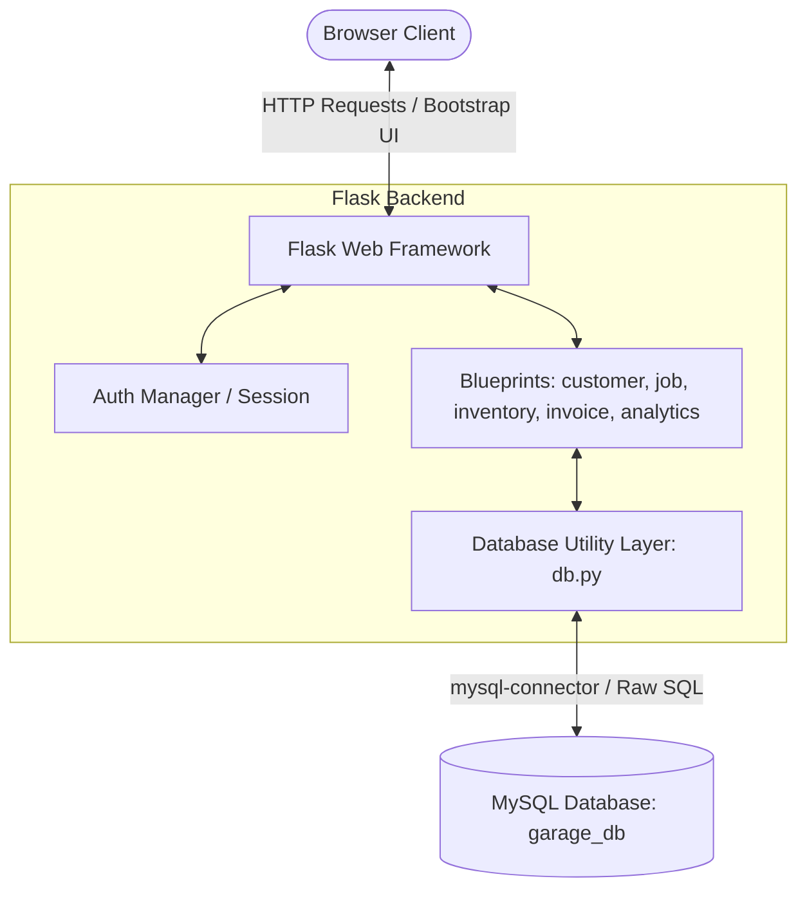

# Technical Requirements Document (TRD)
## Project Name: Fender - Automobile Garage Management System

---

## 1. System Architecture
Fender utilizes a classic **Model-View-Controller (MVC)** architectural pattern implemented on a lightweight stack designed for local deployment:



- **Frontend (View)**: Responsive, flat dark-mode UI built using **HTML5**, **Bootstrap 5 (CSS/JS)**, **Bootstrap Icons**, and **Chart.js** (for client-side analytics rendering).
- **Backend (Controller)**: **Python 3.x + Flask**. Modular routing using Flask Blueprints. No heavy ORMs are utilized; all queries are executed as parameter-driven raw SQL strings to highlight relational queries.
- **Database (Model)**: **MySQL Community Server**. Enforces relational schemas, primary/foreign keys, uniqueness constraints, and transactional execution.

---

## 2. Recommended Folder Structure
The following structure organizes the project codebase logically, separating route controllers, public static assets, templates, and database scripts:

```text
fender/
│
├── database/                   # Existing SQL scripts (DO NOT MODIFY)
│   ├── schema.sql              # Database structure definitions
│   └── sample_inserts.sql      # Seed data inserts
│
├── app/                        # Main application package
│   ├── __init__.py             # App initialization & factory
│   ├── db.py                   # MySQL connection pooling & utility functions
│   ├── auth.py                 # Login, session, role-based helpers
│   │
│   └── routes/                 # Blueprint modules
│       ├── dashboard.py        # Central home page routes & counts
│       ├── customers.py        # Customer & Vehicle CRUD controllers
│       ├── inventory.py        # Supplier & Spare Part CRUD controllers
│       ├── jobs.py             # Service job sheets, assignments & updates
│       ├── billing.py          # Invoices, totals calculations & payments
│       ├── analytics.py        # Data endpoints for Chart.js rendering
│       └── db_showcase.py      # Educational route explaining DBMS concepts
│
├── static/                     # Static files (CSS, JS, assets)
│   ├── css/
│   │   └── style.css           # Global custom dark-mode styling overrides
│   └── js/
│       ├── dashboard_charts.js # Chart.js drawing configurations
│       └── main.js             # General DOM bindings & dynamic UI handling
│
├── templates/                  # Jinja2 HTML templates
│   ├── base.html               # Parent blueprint containing navbar & sidebar
│   ├── login.html              # Standalone login template
│   ├── dashboard.html          # Main metrics & active jobs list
│   ├── customers/              # Customers and vehicles views
│   ├── inventory/              # Supplier and spare parts catalogs
│   ├── jobs/                   # Job listings and update diagnostics
│   ├── billing/                # Invoice lists and printable receipt view
│   ├── errors/                 # Custom error templates (400, 404, 500)
│   └── db_showcase.html        # Concept overview and ER diagram viewer
│
├── requirements.txt            # Python environment dependencies
├── run.py                      # Application entry point
└── README.md                   # Setup guide and instructions
```

---

## 3. Database Connection Strategy
Connection management uses a **Thread-Safe MySQL Connection Pool** via `mysql.connector.pooling` in `app/db.py`. This ensures high performance, automatic connection reuse, and prevents socket exhaustion.

### Connection Configuration File
The database configuration details are fetched from environment variables with safe defaults:

```python
# app/db.py
import mysql.connector
from mysql.connector import pooling
import os

db_config = {
    "host": os.environ.get("DB_HOST", "localhost"),
    "user": os.environ.get("DB_USER", "root"),
    "password": os.environ.get("DB_PASSWORD", "root_password"),
    "database": os.environ.get("DB_NAME", "garage_db"),
    "port": int(os.environ.get("DB_PORT", 3306))
}

# Create a connection pool (min 1, max 5 connections for a local project)
try:
    connection_pool = pooling.MySQLConnectionPool(
        pool_name="fender_pool",
        pool_size=5,
        pool_reset_session=True,
        **db_config
    )
except mysql.connector.Error as err:
    print(f"Error creating connection pool: {err}")
    connection_pool = None
```

### Context-Manager Safe Execution
To prevent connection leaks, all queries use a custom context manager that yields a cursor and automatically releases the connection back to the pool:

```python
from contextlib import contextmanager

@contextmanager
def get_db_cursor(commit=False):
    """Context manager for obtaining a database connection and cursor."""
    conn = connection_pool.get_connection()
    cursor = conn.cursor(dictionary=True) # Returns records as dicts
    try:
        yield cursor
        if commit:
            conn.commit()
    except Exception as e:
        conn.rollback()
        raise e
    finally:
        cursor.close()
        conn.close() # Connection returned to pool
```

---

## 4. Query Handling & SQL Injection Prevention
Fender forbids direct string interpolation (e.g. `f"SELECT * FROM customer WHERE name = '{name}'"`) to protect against SQL Injection. Instead, it utilizes parameterized queries:

- **Correct Pattern**:
  ```python
  query = "SELECT * FROM customer WHERE customer_id = %s"
  cursor.execute(query, (customer_id,))
  result = cursor.fetchone()
  ```

---

## 5. Error & Constraint Violation Handling
Database errors, particularly constraint violations, are caught in the controller layer. Instead of crashing the server, the application maps standard MySQL error codes to descriptive flash messages shown in the UI:

| Error Code | MySQL Condition | UI Action |
| :--- | :--- | :--- |
| **1062** | Duplicate Entry (Unique Constraint violation) | Shows alert: *"Error: Registration Number or Username already exists."* |
| **1451** | Cannot delete parent row (Foreign Key restriction) | Shows alert: *"This record cannot be deleted because other active files (e.g. vehicles, invoices) depend on it."* |
| **1452** | Cannot add/update child row (Foreign Key mismatch) | Shows alert: *"Invalid ID selected for related record."* |

---

## 6. Route & Blueprint Mappings
The routing logic is split into five distinct functional blueprints:

1. **`auth_bp` (Authentication)**:
   - `POST /login`: Processes username and password matching.
   - `GET /logout`: Cleans session dict.
2. **`customer_bp` (Customer Operations)**:
   - `GET /customers`: Displays customer lists with search filtering.
   - `POST /customers/add`: Handles insertion of customer profiles.
   - `POST /customers/edit/<id>`: Handles updates.
   - `POST /customers/delete/<id>`: Handles deletion (restricting if jobs/invoices exist).
   - `POST /vehicles/add`: Adds a vehicle under a specific customer.
3. **`inventory_bp` (Inventory Control)**:
   - `GET /inventory`: Displays spare parts and reorder indicators.
   - `POST /parts/add`: Inserts new parts.
   - `POST /parts/edit/<id>`: Updates parts specs (prices, stocks).
   - `GET /suppliers`: Lists and manages suppliers.
4. **`jobs_bp` (Service Job Lifecycle)**:
   - `GET /jobs`: Lists jobs filtered by status (`Pending`, `In Progress`, `Completed`).
   - `POST /jobs/create`: Intakes a new service job.
   - `GET /jobs/<id>/edit`: Renders the workshop diagnostics form.
   - `POST /jobs/<id>/update`: Saves diagnostic updates, labour costs, and parts lists.
5. **`billing_bp` (Invoicing & Checkout)**:
   - `GET /invoices`: Displays billing logs.
   - `GET /invoices/<id>`: Printable receipt template.
   - `POST /invoices/<id>/pay`: Updates payment status and method.

---

## 7. Security Limitations
Fender is intentionally built as an academic DBMS mini-project. As such, it maintains a lightweight footprint by avoiding production-grade security layers:
1. **Plaintext Passwords**: Passwords are saved inside the `user` table exactly as inputted (no hashing).
2. **Session-based Authentication**: Auth records are saved within standard Flask cookies.
3. **No JWT/Token Complexity**: Authentication and route authorization are governed by checking if `'role'` and `'user_id'` are present in Flask's session object.
4. **Local Host Only**: Assumes deployment runs locally on `127.0.0.1` accessing a local MySQL server instance.
